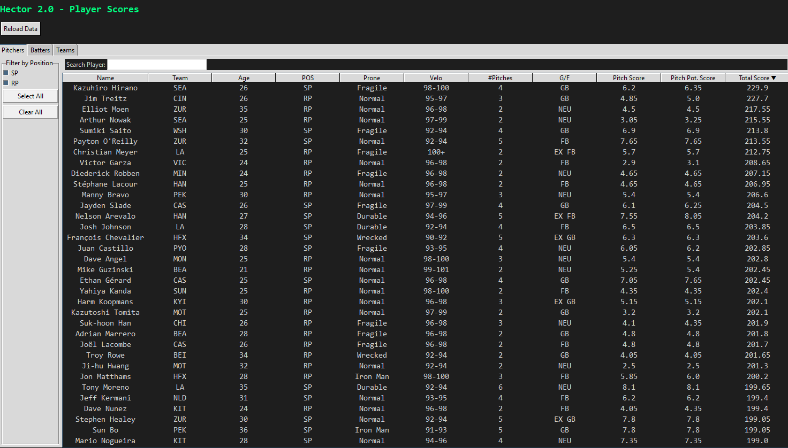
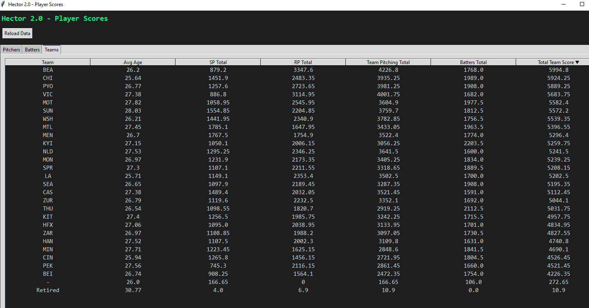
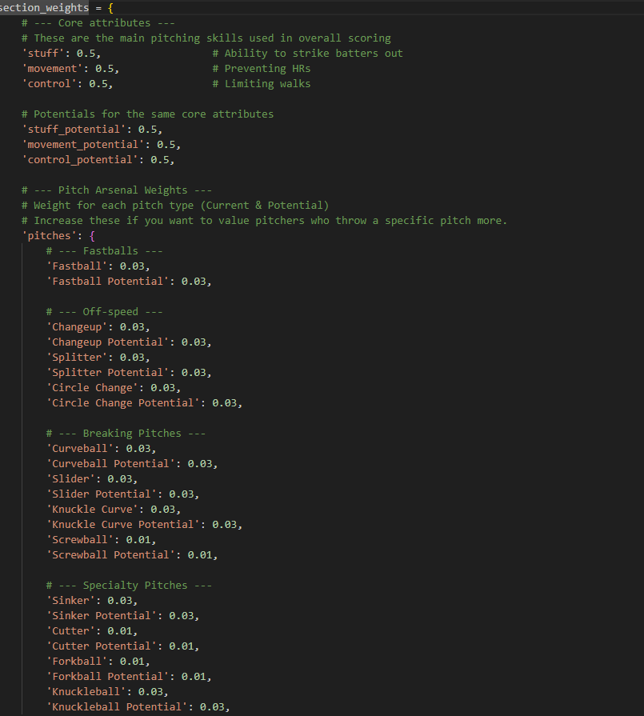
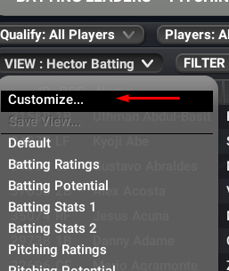
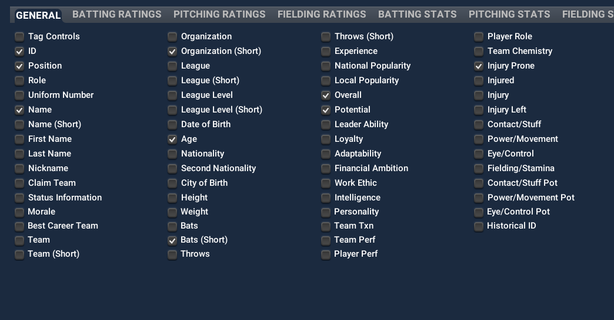
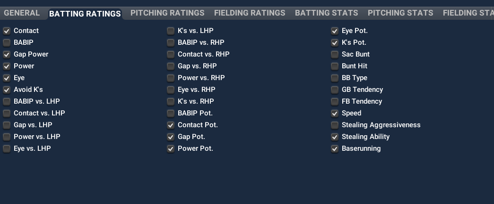
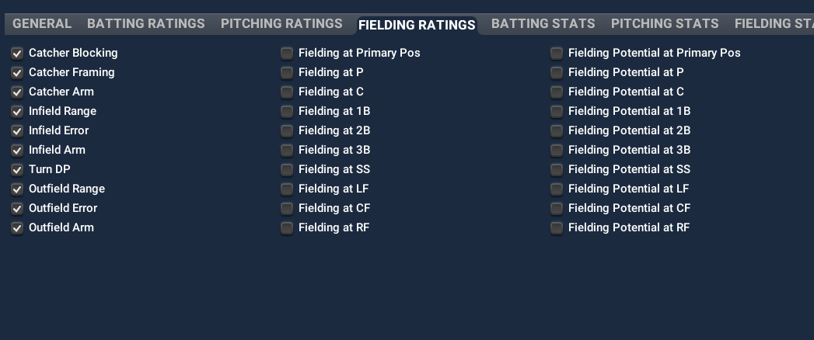
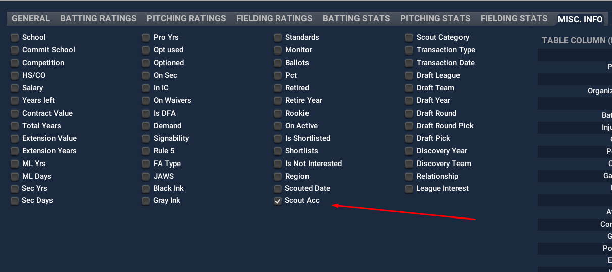
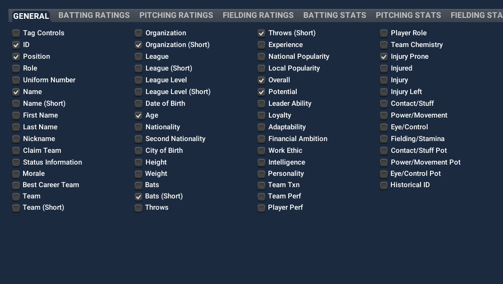
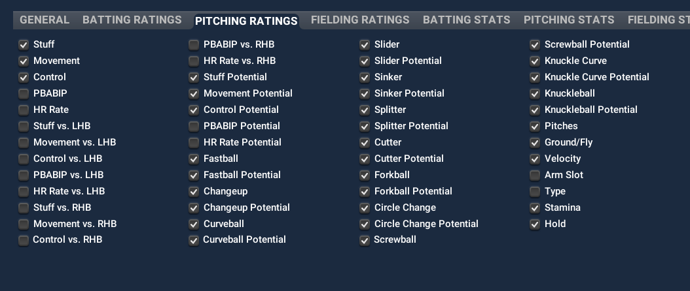

# Hector 2.0

## Downloading the Latest Version

You can always grab the newest build of Hector from the **Releases** page:

➡️ [**Download the latest version here**](../../releases)

1. Download the ZIP for the latest release.  
2. Extract it to a folder of your choice.  
3. Run the executable (or use Python if running from source).  

  
Show screenshots

  
    
    
    

---

## Editing Player Weights

Hector’s scoring system is **fully customizable**.  

- Pitcher scoring weights are defined in `pitcher_weights.py`.  
- Batter scoring weights are defined in `batter_weights.py`.  

To adjust how different stats affect player scores:
1. Open either `pitcher_weights.py` or `batter_weights.py` in a text editor.  
2. Modify the numeric values in the `section_weights` dictionary. Higher values give more importance to that attribute.  
3. Save the file and click **"Reload Data"** in Hector’s GUI (no restart needed).  

---

# Planned Improvements

- Show top 10 Potential batters at each position (25 and Under, Offense Potential + Defense)  
- Show Top 10 Potential pitchers at SP/RP (Core attributes potential + Pitch potential)  
- Show top 10 total score for batters at each position  
- Show top 10 total score for pitchers at each position  
- Recommend RP who could move to SP (3 or more pitches, 50 or higher stamina, ranked by score)  
- Recommend 1B who could move to other positions (Range 50 or higher, arm 45 or higher, turn DP above 40, error above 40)  
- Filter by age with `<` or `>` along with other search filters. For example: `>25 CAS 1b`
- Make reload data also reload player weights
- General visual and UI improvements - add scroll bar 

---

# Hector Data Export Instructions

To ensure Hector works correctly, you need to export player data from OOTP with custom views for Batters and Pitchers using specific attributes. Follow the steps below carefully:

## 1. Create the Batters View

Include all the attributes shown in the following screenshots exactly as displayed.

  
  
  
  
  

## 2. Create the Pitchers View

Include all the attributes shown in these screenshots exactly as displayed.

  
  
  

## 3. Save Views as Global

- Save each view as **Global**.  
- Name them **“Hector Batting”** and **“Hector Pitching”** (you can replace "Hector" with any name you prefer).

## 4. Export Views

- Export the Batters view as `batters.html`  
- Export the Pitchers view as `pitchers.html`

## 5. Replace Existing Files

- Replace the files inside the `Hector` folder with your new `batters.html` and `pitchers.html` exports.

---

Make sure these steps are followed carefully to avoid missing fields or errors when running Hector.

If you encounter any issues or missing data warnings, double-check your export views to ensure all required attributes are included.

---

Thank you for using Hector!

# Features of Hector 2.0 

## Modern Tkinter GUI
- Dark-themed interface with customized fonts and colors for readability  
- Responsive tabbed layout with views for **Pitchers**, **Batters**, and **Teams**  
- Search bars with live filtering and integrated clear ("✕") buttons  
- Position filters with multi-select checkboxes and quick "Select All" / "Clear All" options  
- Sortable tables with custom sort logic for special columns (e.g., velocity ranges, durability categories)  
- Visual arrow indicators for sort direction  
- Row hover highlight for better readability  
- Double-click player rows to open detailed stats in an external web browser  
- Manual "Reload Data" button to refresh data and UI without restarting the app  

## Data Loading & Scoring Features

### Pitchers
- Parses local `pitchers.html` files using BeautifulSoup to extract detailed stats  
- Uses customizable `pitcher_weights` for weighted scoring of multiple pitching attributes  
- Calculates total score combining core skills (Stuff, Movement, Control) and their potential scores  
- Includes individual pitch type scores and potentials (fastball, curveball, slider, etc.)  
- Weights other attributes like number of pitches thrown, velocity, stamina, ground/fly ratio, holds, scout accuracy, overall and potential ratings  
- Applies penalties for starting pitchers with low pitch counts or stamina  
- Supports nuanced velocity parsing (e.g., ranges like "90-92 mph" and "+" modifiers)  

### Batters
- Parses local `batters.html` files using BeautifulSoup for comprehensive player attributes  
- Calculates separate offensive current and potential scores weighted by attributes like contact, gap, power, eye discipline, and strikeouts  
- Computes defensive scores adjusted for position-specific skills:
  - Catchers: ability, arm, blocking  
  - Infielders: range, errors, arm strength (with emphasis on SS and 3B)  
  - Outfielders: range (prioritizing CF), error rates, arm strength  
- Adds weighting for speed, stealing, running, and scout accuracy  
- Combines offense and defense into a total player rating  
- Extracts and displays overall and potential star ratings  

## Team Scores Aggregation
- Calculates cumulative team stats by aggregating pitcher (SP, RP) and batter scores  
- Summarizes overall team strength with pitching and batting breakdowns  

## Modular & Dynamic Design
- Loads data and weighting configurations dynamically from separate modules  
- Enables easy tuning of scoring weights without restarting the application  
